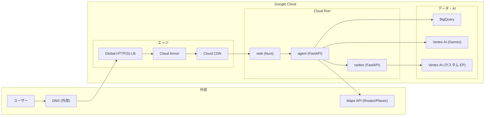

# インフラ（IaC）

Google Cloud のリソースを Terraform でコード管理します。このリポジトリ内の `infra/terraform/` で定義し、適用は手元または CI から行います。

## 📋 目次

- [方針](#方針)
- [前提](#前提)
- [本サービスで利用する Google Cloud サービスと IaC の対応](#本サービスで利用する-google-cloud-サービスと-iac-の対応)
- [システムアーキテクチャ](#システムアーキテクチャ)
- [構成](#構成)
- [使い方](#使い方)
- [管理対象と未管理](#管理対象と未管理)
- [変数の扱い（テンプレート利用時）](#変数の扱いテンプレート利用時)
- [Cloud Run の定義とデプロイ](#cloud-run-の定義とデプロイ)

## 方針

- **Terraform**: プロジェクトの「土台」に加え、**Cloud Run の設定は Terraform で定義（テンプレート）**として持つ。実環境のパラメータ（timeout / memory / cpu / env など）を `cloud_run.tf` に反映済み。
- **Cloud Run のデプロイ**: **従来どおり GitHub Actions（`gcloud run deploy`）で実施**。Terraform は「設定の参照・テンプレート」として使い、実際のデプロイは CI のまま。
- **変数の切り分け**: **変更が必要なもの**（サービス名・キー・URL・データセット ID・バージョン名など）は変数（`variables.tf` + `terraform.tfvars`）で外出しし、**その部分だけ変えれば他環境でも使える**ようにしている。**普遍的なもの**（リソースの timeout / memory / CPU / スケール、IAM ロール・ポリシーなど）はコードにそのまま書いてあり、テンプレートを流用するユーザーもそのまま利用できる。
- **状態ファイル**: 本番用は GCS バケットに保存することを推奨（`backend "gcs"`）。ローカルで試す場合は `backend "local"` または未指定で可。

## 前提

- 利用する GCP プロジェクトは既に存在する想定（`firstdown-482704` など）。プロジェクト自体の作成も Terraform で行う場合は `google_project` を追加してください。
- Terraform を実行する identity（手元の gcloud または CI のサービスアカウント）に、プロジェクトに対する適切な権限（編集者または必要な最小ロール）があること。

## 本サービスで利用する Google Cloud サービスと IaC の対応

firstdown で利用している Google Cloud のサービス一覧と、この IaC（Terraform）で管理するかどうかの対応です。

| Google Cloud サービス | 本サービスでの用途 | IaC で管理 | 備考 |
|------------------------|-------------------|------------|------|
| **Cloud Run** | Agent / Ranker / Web の実行基盤 | 定義のみ（任意で apply 可） | agent・ranker は `cloud_run.tf` に定義。web は未定義。デプロイは GitHub Actions 等で実施 |
| **ロードバランサー（Global HTTP(S) LB）** | カスタムドメイン（tekuteq.com 等）で Web を公開 | しない | 実環境: URL マップ `tekuteq-external-alb`、バックエンド `tekuteq-backend-web`、NEG（Cloud Run **web**）。LB→NEG→web でカスタムドメイン公開。IaC 化する場合は Terraform で追加可 |
| **Cloud Armor** | LB バックエンドへのレート制限・WAF | しない | 実環境でバックエンドにポリシー紐づけ（例: 500 req/60秒/IP）。IaC 化する場合は Terraform で追加可 |
| **Cloud CDN** | LB 経由の静的コンテンツのキャッシュ | しない | 実環境でバックエンドに CDN 有効（CACHE_ALL_STATIC 等）。IaC 化する場合は Terraform で追加可 |
| **Artifact Registry** | Agent / Ranker の Docker イメージ保存 | ✅ する | リポジトリ `agent-repo`, `ranker-repo` を Terraform で作成 |
| **BigQuery** | ログ・分析（リクエスト・候補・提案・フィードバック・ランク結果） | ✅ する | データセットを Terraform で作成。テーブル DDL は `ml/agent/bq/` 等で別管理 |
| **Vertex AI（LLM）** | 紹介文・タイトル生成（Gemini 等のフルマネージド LLM） | API 有効化のみ | モデルは API 経由で利用するだけ。Terraform でリソース作成は不要 |
| **Vertex AI（カスタムモデル）** | ランカー用カスタム推論エンドポイント（XGBoost 等） | しない | エンドポイント・デプロイ済みモデルは未管理（実環境の例: `ranker-xgb-endpoint-20260211-0201`）。必要なら別モジュールで追加可 |
| **Google Maps Platform**（Routes API, Places API, Maps JavaScript API） | ルート生成・スポット検索・地図表示 | API 有効化のみ（maps-backend） | API キーは手動または CI の環境変数で設定。Terraform では持たない |
| **IAM（サービスアカウント・ロール）** | Agent Cloud Run の実行 ID、Vertex AI・BigQuery への権限付与 | ✅ する | Agent 用 SA の作成または既存参照＋ロール付与を Terraform で実施（`iam.tf`） |
| **Cloud Logging** | Cloud Run の標準出力・アプリログの収集・検索 | しない | デフォルトで有効。アラート・シンク・除外フィルタ等は未定義。長期保存は GCS シンクを必要時追加可 |
| **Cloud Monitoring** | メトリクス・ダッシュボード・アラート | しない | デフォルトでメトリクスは収集される。アラートポリシー・ダッシュボードは未定義。必要時 Terraform で追加可 |

**凡例**
- **✅ する**: リソースの作成・更新を Terraform で行う
- **定義のみ**: 設定を Terraform に書くが、実際のデプロイは CI など別手段（Cloud Run が該当）
- **API 有効化のみ**: その API をプロジェクトで使えるようにするだけ。リソース本体は未管理
- **しない**: この IaC では管理しない（手動・別ツール）

## システムアーキテクチャ

本サービスの Google Cloud 上の構成を Mermaid で示します。GitHub や Mermaid 対応の Markdown ビューアで図として表示されます。公式アイコンで描く場合は [Google Cloud のアーキテクチャ図用アイコン](https://cloud.google.com/architecture/diagrams) や [draw.io の GCP アイコンセット](https://www.drawio.com/blog/google-cloud-platform-icons/) を利用できます。



- **フロント（カスタムドメイン）**: ユーザー → 外部 DNS → Global LB → Cloud Armor → Cloud CDN → NEG → Cloud Run **web**
- **API 連携**: **web** が **agent** を呼び出し、**agent** が Ranker / Vertex AI（LLM）/ BigQuery / Maps API を利用。**ranker** が Vertex AI カスタムエンドポイントで推論。

## 構成

```
infra/
├── README.md           # 本ドキュメント
└── terraform/
    ├── main.tf          # プロバイダー、プロジェクト、API 有効化
    ├── variables.tf    # 変数定義
    ├── outputs.tf      # 出力値
    ├── artifact_registry.tf  # Artifact Registry リポジトリ
    ├── bigquery.tf     # BigQuery データセット
    ├── iam.tf           # サービスアカウントと IAM
    ├── cloud_run.tf     # Cloud Run 定義（実環境パラメータのテンプレート。デプロイは CI）
    ├── backend.tf.example   # GCS バックエンドの例
    └── terraform.tfvars.example  # 変数例（tfvars は .gitignore 推奨）
```

## 使い方

### 1. 初回準備

```bash
cd infra/terraform
cp terraform.tfvars.example terraform.tfvars
# 変更が必要なものだけ編集（project_id, region, ranker_service_url など）
# Agent を利用する場合は ranker_service_url を必ず設定（未設定だと RANKER_URL が空になる）

# 既に手動で agent-runtime-sa を作成済みの場合は、Terraform で SA を新規作成せず IAM のみ付与する
# create_agent_runtime_sa = false を terraform.tfvars に追加

# GCS バックエンドを使う場合
cp backend.tf.example backend.tf
# backend.tf の bucket 名を編集
```

### 2. 実行

```bash
terraform init
terraform plan   # 変更内容の確認
terraform apply  # 適用（yes で確定）
```

### 3. 状態を GCS に置く場合（推奨）

1. 手動または別の Terraform で GCS バケットを作成（例: `firstdown-482704-tfstate`）。
2. `backend.tf.example` をコピーして `backend.tf` を作成し、`bucket` をそのバケット名に変更。
3. `terraform init` で「Migrate state to backend?」と出たら `yes` で移行。

## 管理対象と未管理

| リソース | Terraform での管理 | 備考 |
|----------|---------------------|------|
| プロジェクトで利用する API の有効化 | ✅ | Cloud Run, Artifact Registry, BigQuery, Vertex AI など |
| Artifact Registry リポジトリ | ✅ | `agent-repo`, `ranker-repo` |
| BigQuery データセット | ✅ | `firstdown_mvp`。テーブルは DDL（`ml/agent/bq/*.sql`）で別管理可 |
| サービスアカウント・IAM | ✅ | Agent 実行用 SA など |
| Cloud Run サービス | 定義のみ（任意で apply 可） | 実環境のパラメータを `cloud_run.tf` に定義。デプロイは GitHub Actions の gcloud のまま。[下記](#cloud-run-を-terraform-で管理する場合) 参照 |
| Vertex AI Endpoint | 任意 | ランカー用カスタムモデル。必要なら別モジュールで追加 |

## 変数の扱い（テンプレート利用時）

| 種別 | 例 | 扱い |
|------|-----|------|
| **変更しがちなもの（外出し）** | プロジェクト ID・リージョン、サービス名、Ranker URL、データセット ID、Artifact Registry 名、SA 名、FEATURES_VERSION / VERTEX_TEXT_MODEL / MODEL_VERSION / RANKER_VERSION、API キー | `variables.tf` で定義し、環境ごとに `terraform.tfvars`（または環境変数 `TF_VAR_*`）で**ここだけ変更**すればよい |
| **普遍的なもの（コードのまま）** | timeout・memory・CPU・concurrency・min/max instance、IAM ロール（run.invoker, aiplatform.user, bigquery 等）、allUsers ポリシー | `.tf` にそのまま記載。他ユーザーがテンプレートでサービスを構築するときも**そのまま使える** |

初回は `terraform.tfvars.example` をコピーして `terraform.tfvars` を作成し、`project_id`・`ranker_service_url` など必要な項目だけ編集して使う。

## Cloud Run の定義とデプロイ

- **定義**: `infra/terraform/cloud_run.tf` に実環境のパラメータ（timeout=300/30、memory、cpu、env など）を反映した `google_cloud_run_v2_service` を定義済み。**設定の参照・テンプレート**として利用する。
- **デプロイ**: 引き続き **GitHub Actions の `gcloud run deploy`** でイメージのビルド・プッシュ・デプロイを行う。MAPS_API_KEY 等のシークレットは CI の `--set-env-vars` や Secret Manager で渡す想定（Terraform には持たない）。

### Terraform で Cloud Run を「作成・更新」する場合（任意）

- 変数 `agent_image` / `ranker_image` にイメージ URL を渡して `terraform apply` すると、Terraform が Cloud Run サービスを作成・更新する。
- 変数を空のまま（デフォルト）にすると、Cloud Run リソースは **作成されない**（既に CI でデプロイされているサービスをそのまま利用）。その場合でも `.tf` には実環境と同じ設定が書かれており、ドキュメント・テンプレートとして参照できる。

## リンク

- [プロジェクト全体の README](../README.md)
- [Terraform Google Provider](https://registry.terraform.io/providers/hashicorp/google/latest/docs)
